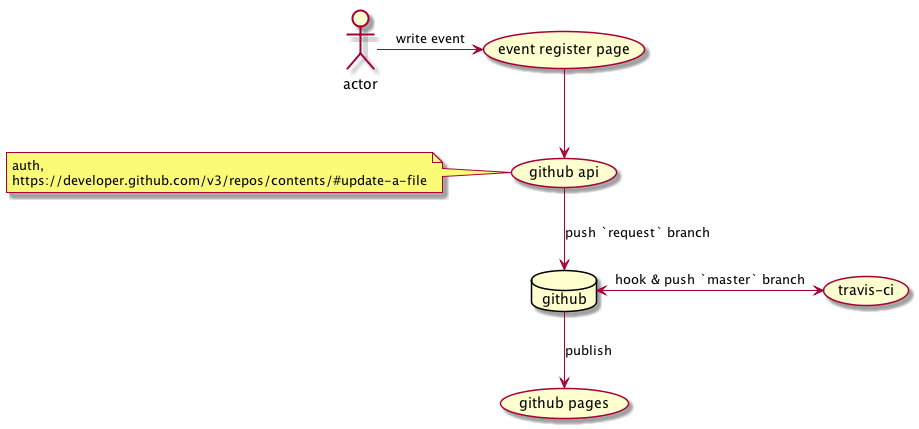

meetup.clj
==========

[](https://travis-ci.org/netpyoung/meetup.clj)

# meeup.clj

I want to website for share idea, meetup date or something.

It inspired of [dev-meetup](https://dev-meetup.github.io/). But It is written in [Clojure](https://clojure.org/).


We’ll find a way. We always have. -Cooper #Interstellar

# flow


# tree

```
|- @document : document
|- docs : github-pages
|- project : meetup project directory
|- script : unused.
|- README.md
|- Rakefile
```

# TODO
- [ ] move to data folder
- [ ] codeformat check on CI
- [ ] refactoring
- [ ] pull request && ci process
  - [ ] [TRAVIS_BRANCH, TRAVIS_PULL_REQUEST, TRAVIS_PULL_REQUEST_BRANCH](https://docs.travis-ci.com/user/environment-variables/)
  - [ ] https://stackoverflow.com/questions/23277391/how-to-publish-to-github-pages-from-travis-ci
- [ ] presentation page
- [ ] input page
  - [ ] https://github.com/reagent-project/reagent-cookbook/tree/master/recipes/input-validation
  - [ ] https://github.com/reagent-project/reagent-cookbook/tree/master/recipes/markdown-editor
  - [ ] https://github.com/github-tools/github
- [ ] gzip scripts
- [ ] [meetup api](https://www.meetup.com/meetup_api/auth/)
- [ ] [export google calender](https://developers.google.com/google-apps/calendar/v3/reference/events/import)
- [ ] search / filter
- [ ] [JVM opts](https://dev.clojure.org/display/design/Improving+Clojure+Start+Time)

# ref
* http://d2.naver.com/helloworld/303083
